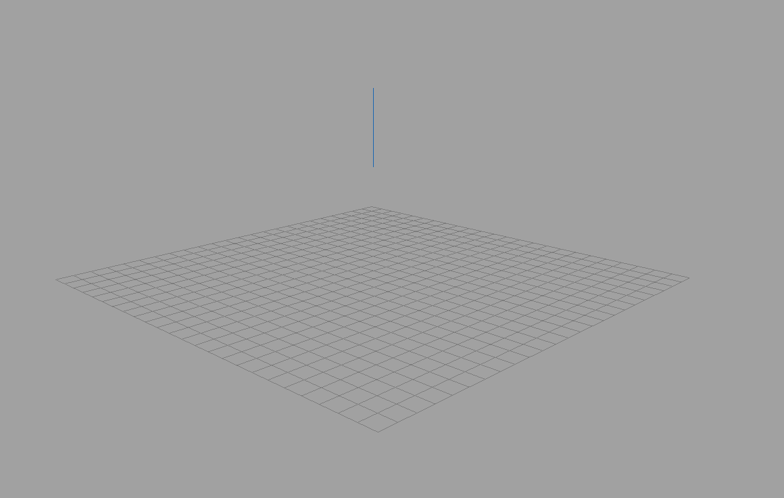
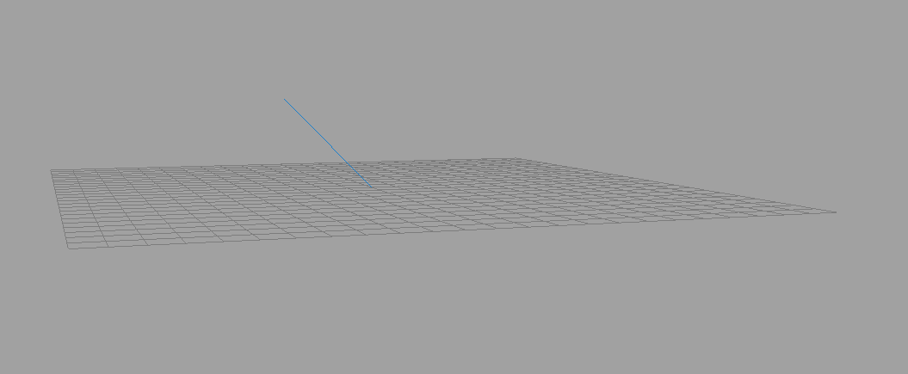

# Springs
Spring Mass Systems • Evan Wilde • CSC 473

The scenes have a simple interface. In both scenes, the spacebar will start the simulation and
pause it.

In both scenes, the spring is shown as a blue line. In the linear spring system, the line will
stretch and shrink as expected with a spring. It will also swing as a pendulum due to the effects
of gravity. In the angular spring, the link will simply swing to the rest angle of the spring.

## Navigation

Navigation is obtained through use of the mouse.
Simply holding the middle mouse button allows the user to tumble the camera to the angle they desire.
Scrolling allows the user to dolly the camera on increments, whereas the user may hold the CTRL key
and hold the middle mouse button to dolly smoothly. Holding shift allows the user to track the camera;
however, the camera will still tumble around the origin of the scene.

- Dolly: scroll / ctrl + middle mouse
- Tumble: middle mouse
- Track: Shift + middle mouse
- Reset: r

## Linear Spring

The linear spring system consists of a fixed point and a free mass. All calculations are in the
Cartesian coordinate system.

Integration was done with the basic Euler integrator. For the single spring-mass system, the
Euler integrator is fully sufficient for handling the calcuations. When we add more springs
into the system, a more powerful integration method may be necessary.

### Extra Controls

- Q: Increase the length of the spring by 0.25
- E: Decrease the length of the spring by 0.25
- W: Move the fixed point of the spring along the z axis by 1
- S: Move the fixed point of the spring along the z axis by -1
- D: Move the fixed point of the spring along the x axis by -1
- A: Move the fixed point of the spring along the x axis by 1

## Torision Spring

The torsion spring calculations are performed entirely in spherical coordinates. This coordinate
system makes sense as the spring is given a fixed point origin and a rod of constant length that
can move around the fixed point. No calculations were to be performed on the length of the rod,
and only on the angle that the rod protruded from the fixed point. A mousetrap is an example of
this system if the coefficient were set high enough. Unlike the mouse trap, the spring is able to
rotate with two degrees of freedom, though, in practice this is kind of weird to look at and hard
to imagine; however, I'm fairly confident in the results we are seeing. While in the CPU, the
coordinates were entirely in spherical coordinates.

The position is passed to the GPU still in spherical coordinates, we then allow the
GPU to make the conversion from spherical coordinates to the Cartesian coordinate
system, then multiplying that against the MVP matrix to find the final point of the
mass at that time step. While the information is in the CPU, the data is all spherical
coordinates.

Again, basic Euler integration was used in calculating the angular velocity and position.

### Extra Controls

The torsion spring system adds some additional controls beyond the basic controls outlined in Navigation.

- Q: Increase the length of the rod by 0.25
- E: Decrease the length of the rod by 0.25
- W: Rotate the theta component of the resting position by 1 degree
- S: Rotate the theta component of the resting position by -1 degree
- A: Rotate the phi component of the resting position by 1 degree
- D: Rotate the phi component of the resting position by -1 degree
- Z: Increase the mass by 0.5 grams
- X: Decrease the mass by 0.5 grams
- F: Increase the spring constant (Be careful with this)
- G: Decrease the spring constant (Be careful with this)

### Additional Details

The velocity and positions are implemented as two-vectors, since the length of the rod
is held constant. Removing the length component from the calculations until the data is
passed to the GPU keeps us from making the mistake of including that in the vector
calculations. This produces some interesting results, but is utimately not correct.

## Extra Notes

Unfortunately, the scene switching in Atlas is not yet working correctly. As such, we can
only comment out the scene we don't want and recompile. Once the implementation within
Atlas is working correctly, switching between the scenes will allow the user to view both
without restarting the application.

As Atlas is the framework provided with the course, it is beyond the scope of the assignment
to fix this bug within Altas, and therefore, if the feature within Alas worked, it would work
fine.

If scene switching worked, the sceens could be switched using `tab` to go to the next scene.
